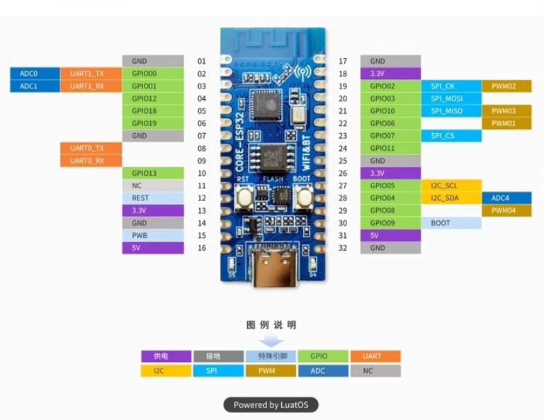
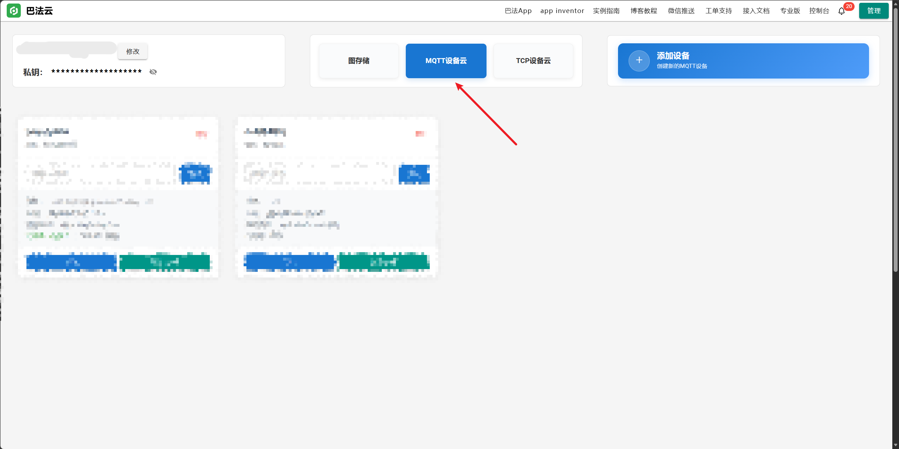
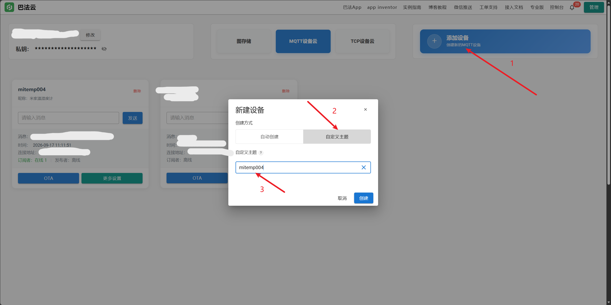
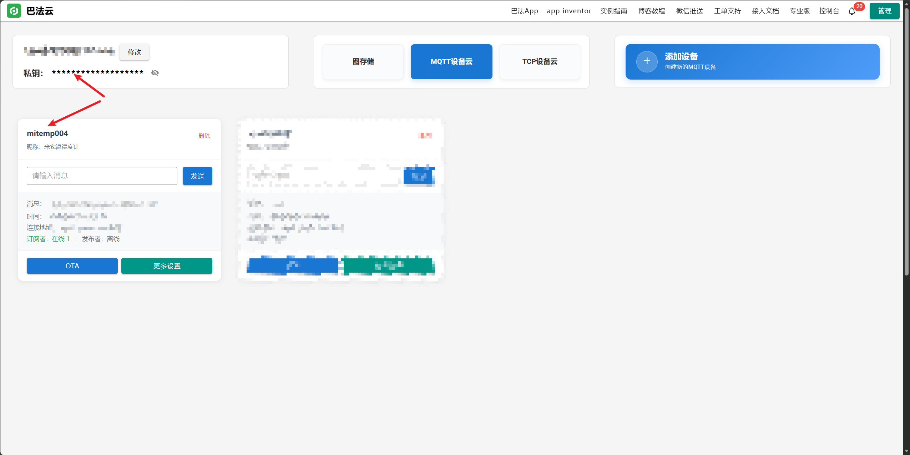
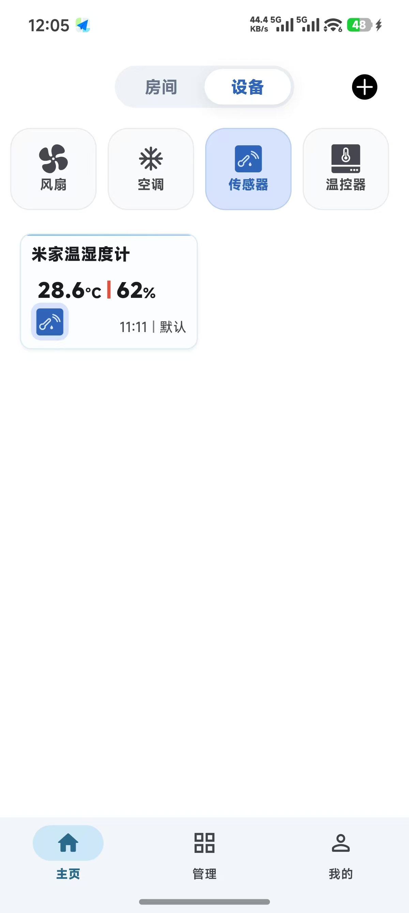
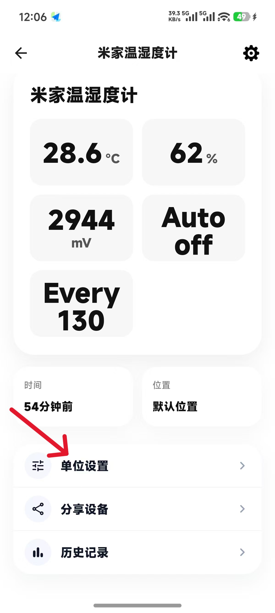
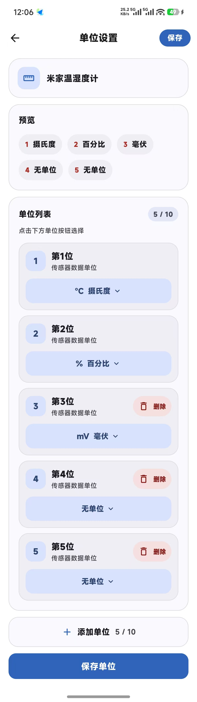
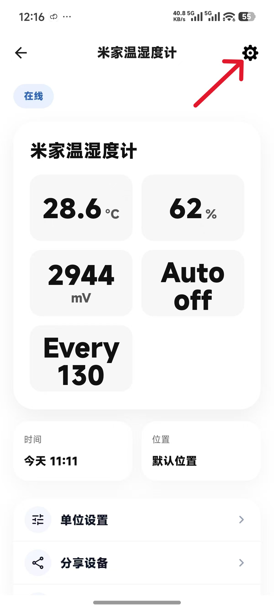
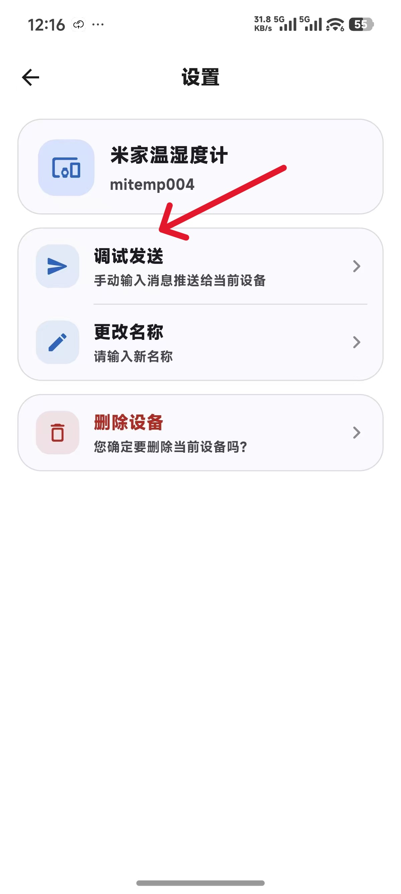
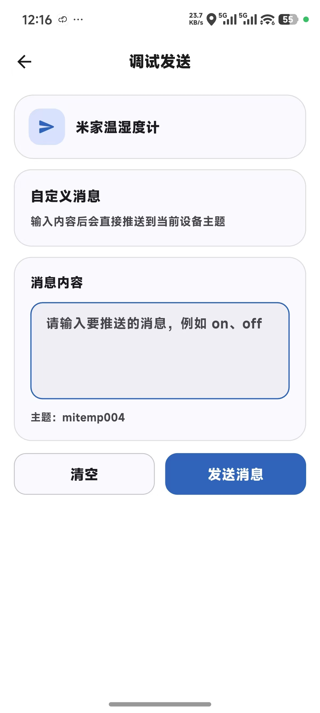

# 米家温湿度计 2（LYWSD03MMC）ESP32-C3 巴法云蓝牙网关

使用 ESP32-C3 连接米家温湿度计 2，并通过巴法云 MQTT 将温度、湿度和电池电压显示到手机 APP。

本项目读取的是温湿度计的 GATT 特征值，不依赖小米绑定密钥。ESP32-C3 通过 Wi‑Fi 保持在线，按配置周期或 APP 命令读取传感器并上传数据。

> **重要说明：本项目当前只支持一台米家温湿度计 2。** 如果附近同时存在多台兼容温湿度计，固件会选择 BLE 信号最强的一台进行连接和读取。

## 功能

- 通过 BLE 主动连接米家温湿度计 2，读取温度、湿度和电池电压。
- 通过巴法云 MQTT 上传到”传感器“主题。
- 支持 APP 自定义消息控制。

## 硬件准备

- ESP32-C3 开发板。
- 米家温湿度计 2（型号通常为 `LYWSD03MMC`）。
- 可连接互联网的 2.4 GHz Wi‑Fi。
- 巴法云账号。

开发板引脚参考：



米家温湿度计 2 ：


图片来源：[TerrariumPI：LYWSD03MMC bluetooth sensor](https://theyosh.github.io/TerrariumPI/hardware/sensor/lywsd03mmc-bluetooth-sensor/)，作者 TheYOSH，采用 [CC BY 4.0](https://creativecommons.org/licenses/by/4.0/) 许可。

固件每次读取前都会扫描附近的 BLE 设备，自动选择信号最强且看起来兼容
`LYWSD03MMC` 的温湿度计，然后连接并验证 GATT 服务。如果附近有多台兼容设备，
固件会选择 RSSI（信号强度）最高的一台。

## 软件准备

- VS Code
- PlatformIO插件

本项目使用 PlatformIO 的 Arduino framework，配置位于 `platformio.ini`。

PlatformIO 配置教程：[使用 VS Code 安装 PlatformIO 插件并创建项目（中文教程）](https://www.doitwiki.com/article/details/179030099079168)

## 项目结构

```text
mijia-lywsd03mmc-esp32c3-bemfa-gateway/
├── include/
│   ├── secrets.h.example   # 配置模板
│   └── secrets.h           # 本地配置，不提交到 Git
├── src/
│   └── main.cpp            # 固件主程序
├── platformio.ini          # PlatformIO 配置
└── .gitignore
```

## 开始前：在巴法云创建传感器主题

巴法云官网：[https://cloud.bemfa.com/](https://cloud.bemfa.com/)

巴法 APP 官方下载入口：[点击下载巴法 APP](https://cloud.bemfa.com/web/user/index?c=2)

1. 注册并登录[巴法云控制台](https://cloud.bemfa.com/)。
2. 创建一个 MQTT 设备主题。

在控制台中选择“MQTT 设备云”，然后点击“添加设备”：



3. 主题名称最后三位使用 `004`，让巴法云识别为传感器设备。例如：`mitemp004`。

在“新建设备”窗口中选择“自定义主题”，填写主题名称，例如 `mitemp004`：



4. 记录控制台中的用户私钥，后续填入 `BEMFA_UID`。
5. 将创建的主题名称记录下来，后续填入 `BEMFA_TOPIC`。

控制台首页可以查看用户私钥和已创建的设备主题：



6. 登录巴法云 APP 后设备会自动出现在主页。



在设备详情页点击”单位设置“：



将前 3 个单位分别设置为摄氏度、百分比和毫伏，后 2 个单位设置为无单位：



巴法云相关文档：

- [MQTT 协议接入](https://cloud.bemfa.com/docs/src/mqtt.html)
- [设备类型说明](https://cloud.bemfa.com/docs/src/index_device.html)

## 第一步：创建本地配置文件

复制配置模板：

```powershell
Copy-Item include/secrets.h.example include/secrets.h
```

然后编辑 `include/secrets.h`：

```cpp
#pragma once

// 当前主动 GATT 读取方案不需要绑定密钥，可以留空。
#define MITEMP_BIND_KEY_HEX ""

#define MITEMP_WIFI_SSID "你的WiFi名称"
#define MITEMP_WIFI_PASSWORD "你的WiFi密码"

// 巴法云控制台中的用户私钥。
#define BEMFA_UID "你的巴法云私钥"

// 巴法云传感器主题，例如 mitemp004。
#define BEMFA_TOPIC "你的主题"
```

注意：`include/secrets.h` 包含 Wi‑Fi 密码和巴法云私钥，已经加入 `.gitignore`。

## 第二步：编译和烧录

将项目文件夹用 VS Code 打开，使用 PlatformIO 编译并烧录到连接好的 ESP32-C3 开发板即可。

## 第三步：APP 命令

在巴法云 APP 的自定义消息输入框中发送以下命令。命令区分大小写，分隔符必须使用英文冒号。

在设备详情页点击右上角的设置按钮：



进入设置页面后选择“调试发送”：



在“消息内容”中输入命令，然后点击“发送消息”：



| 命令 | 作用 |
| --- | --- |
| `Auto:on` | 开启自动更 |
| `Auto:off` | 关闭自动更新 |
| `Every:10` | 将自动更新周期设置为 10 分钟`Every:` 后面的范围为 1～1440 分钟。 |
| `Update` | 立即读取并上传一次 |
| `Status` | 输出当前配置 |

`Every:` 后面的范围为 1～1440 分钟。

每条有效命令都会触发一次读取。发送多条命令时，建议间隔几秒，避免在蓝牙扫描期间积压 MQTT 消息。

## 串口日志示例

```text
[CMD] topic=mitemp004 command=Update
[CMD] one-shot update requested
[BLE] sensor candidate=aa:bb:cc:dd:ee:ff, rssi=-60
[BLE] strongest sensor=aa:bb:cc:dd:ee:ff, rssi=-60
[GATT] connecting to aa:bb:cc:dd:ee:ff...
[GATT] connected
[GATT] disconnected
[MEASUREMENT] temperature=28.5C humidity=63% battery=2942mV
[MQTT] publish topic=mitemp004/up payload=#28.5#63#2942#Auto off#Every 80 result=ok
```

## 常见问题

### APP 显示 `Update°C` 或 `Status°C`

这是因为传感器类型的 APP 会把自定义文本临时当成温度字段显示。固件收到命令后会重新读取传感器并通过 `/up` 上传数字数据，正常情况下随后应恢复为温度、湿度和电压显示。

### 串口显示找不到设备

- 确认附近只有一台需要接入的 LYWSD03MMC 温湿度计。
- 将 ESP32-C3 和温湿度计靠近一些。
- 关闭米家 APP、手机 BLE 扫描器或其他可能占用设备的程序。
- 固件每次读取最多会扫描和连接 3 次。
- 确认温湿度计电池有电，并且正在广播 BLE。

### MQTT 已连接但 APP 没更新

重点查看是否出现：

```text
[MQTT] publish topic=mitemp004/up ... result=ok
```

如果读取成功但 MQTT 当时断开，固件会缓存最新读数，待 MQTT 重连后补发。若仍无更新，请检查 `BEMFA_UID`、`BEMFA_TOPIC` 和巴法云主题类型。

### Wi‑Fi 无法连接

- 确认使用的是 2.4 GHz Wi‑Fi。
- 检查 SSID 和密码是否正确。
- 检查 `include/secrets.h` 是否被正确创建并保存。

### 为什么不需要 Xiaomi 绑定密钥

当前固件使用 BLE 主动连接和 GATT 读取特征值，不读取加密广播数据，因此不需要 32 位十六进制绑定密钥。`MITEMP_BIND_KEY_HEX` 仅保留在配置模板中，当前代码不会使用它。

## 当前限制

- 当前只支持一台温湿度计，多台设备同时在附近时会选择信号最强的一台。
- 设备需要持续供电，当前方案不会进入深度睡眠。
- 自动更新默认周期为 60 分钟，可通过 `Every:N` 修改，频率过高可能导致温湿度计耗电增加。
- `Status` 的详细配置会输出到串口，APP 侧主要显示重新上传的传感器数据。

## License

本项目采用 [MIT License](LICENSE) 开源许可证。

你可以自由使用、修改、复制、发布本项目，也可以将其用于商业用途，但需要保留原作者的版权声明和许可证文本。本项目按“现状”提供，不附带任何明示或暗示的担保。
